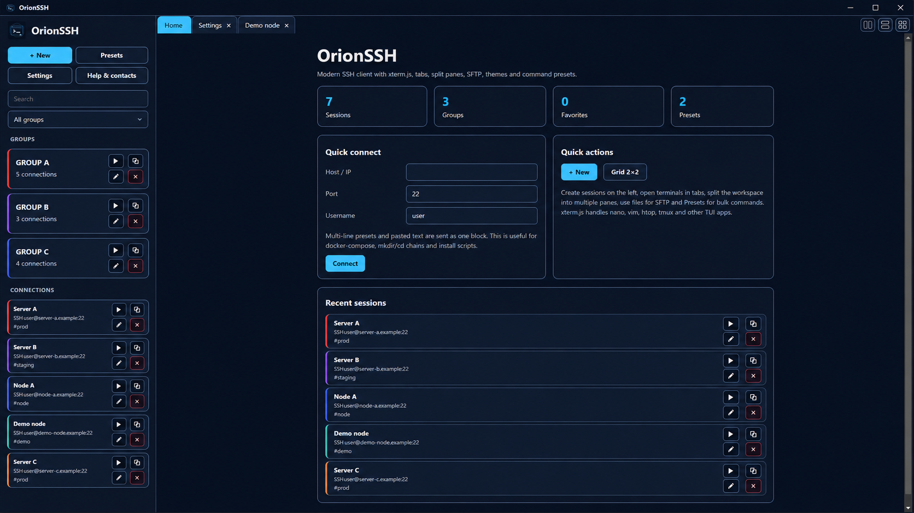
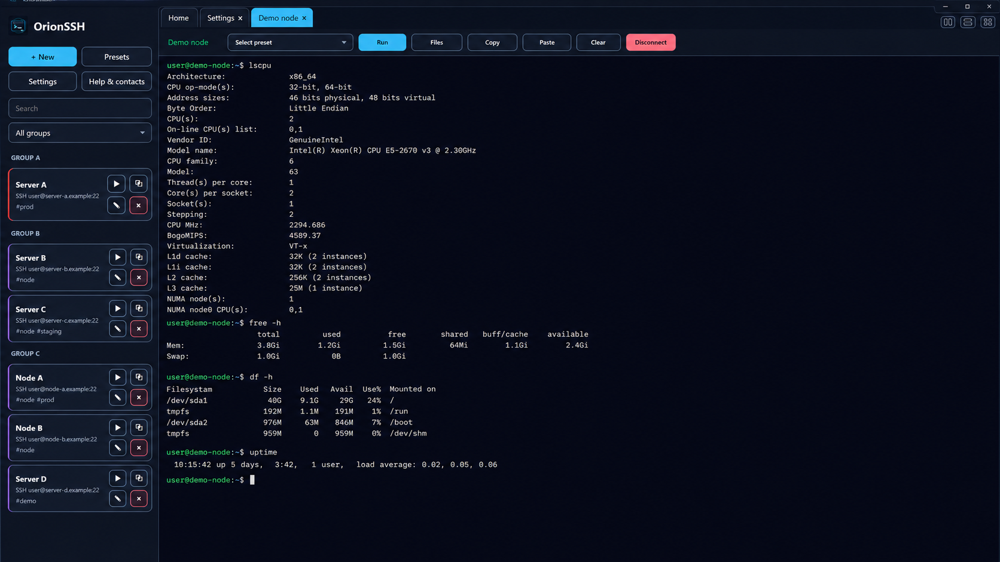
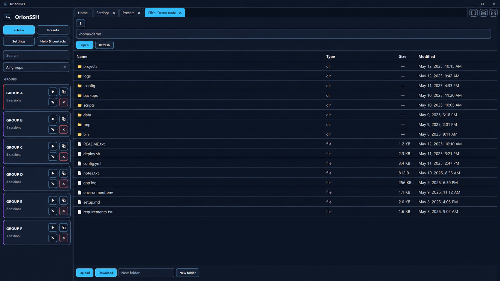

<p align="center">
  
</p>

<h1 align="center">OrionSSH</h1>

<p align="center">
  Современный SSH/SFTP-клиент для Windows на Electron, xterm.js и ssh2.
</p>

<p align="center">
  <a href="README.md">English</a> · <a href="README.ru.md">Русский</a>
</p>

---

## О проекте

OrionSSH — desktop SSH-клиент с настоящим терминальным движком на базе **xterm.js**. Он рассчитан на нормальную работу с интерактивными TUI-программами: `nano`, `vim`, `htop`, `mc`, `tmux`, `screen` и похожими инструментами.

Эта Electron-версия заменяет старую реализацию терминала на Tkinter и даёт намного более стабильную работу терминала.

## Возможности

- SSH-терминал на xterm.js
- SSH-подключения через ssh2
- Корректная работа nano, vim, htop, tmux и других TUI-программ
- Вкладки и split-рабочие области
- Разделение окна на 2 или 4 независимые панели
- SFTP-проводник
- Индикаторы прогресса загрузки и скачивания
- Drag-and-drop загрузка файлов в SFTP
- Пресеты команд с пакетным многострочным выполнением
- Группы, избранное, теги и цветные группы
- Фильтр по группам и ручной порядок подключений
- SSH local port forwarding
- Поддержка Telnet, Serial и запуск RDP
- Кастомизация тем через выбор цветов из палитры
- Русский и английский интерфейс
- Защищённое хранение паролей через OS keyring / Windows Credential Manager, если доступно, с encrypted Electron safeStorage fallback
- Кастомная верхняя панель в цвет приложения

## Скриншоты

Положи свои реальные скриншоты сюда:

```text
docs/screenshots/home.png
docs/screenshots/terminal.png
docs/screenshots/sftp.png
docs/screenshots/settings.png
docs/screenshots/presets.png
```

Пример:

<p align="center">
  
</p>

<p align="center">
  
  
</p>

## Требования

- Windows 10/11
- Node.js LTS
- npm

## Запуск из исходников

```bat
npm install
npm run dev
```

Или на Windows:

```bat
run_windows.bat
```

## Сборка EXE / установщика

```bat
npm install
npm run build
```

Или:

```bat
build_windows.bat
```

Готовые файлы появятся здесь:

```text
release/
```

## Структура проекта

```text
src/main/       Electron main process, SSH/SFTP-сервисы, хранилище, пароли
src/renderer/   UI, xterm.js терминал, темы, вкладки и split-панели
assets/         Иконка и логотип приложения
docs/           Скриншоты и документация
```

## Поддержка

- Email: dev.equinox.e@gmail.com
- Telegram: https://t.me/equinox_robot
- GitHub: https://github.com/Equinox-e/Orion_SSH

## Лицензия

MIT
