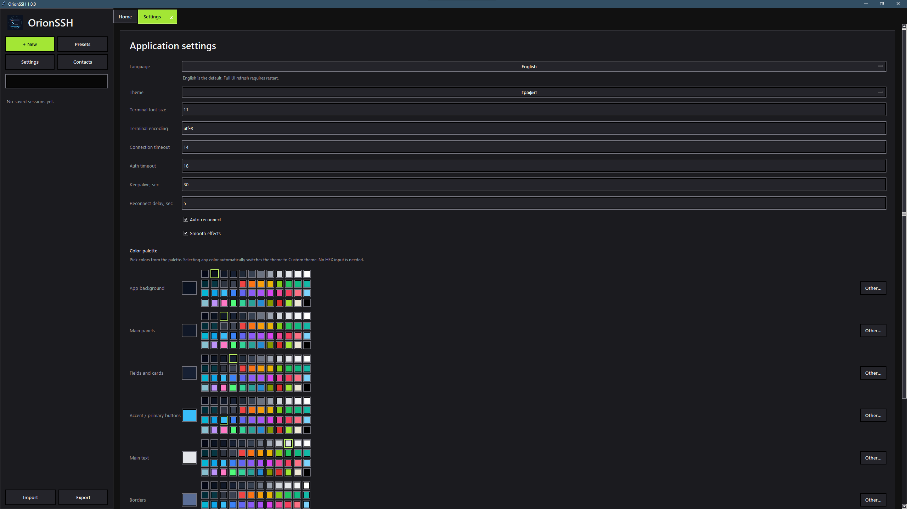
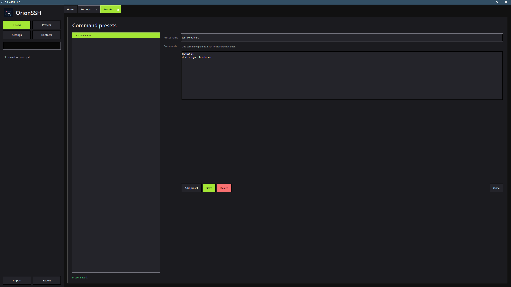

# OrionSSH

<p align="center">
  
</p>

<p align="center">
  <b>Современный SSH-клиент для Windows с сессиями, вкладками, SFTP, темами, пресетами команд и защищённым хранением паролей.</b>
</p>

<p align="center">
  <a href="README.md">English</a> · <a href="README.ru.md">Русский</a>
</p>

<p align="center">
  
  
  
  
</p>

---

## Скриншоты


<p align="center">
  
</p>

<p align="center">
  
  
</p>

<p align="center">
  
  
</p>

---

## О проекте

**OrionSSH** — это настольный SSH-клиент для Windows, созданный для повседневного администрирования серверов. Он объединяет терминал со вкладками, сохранённые подключения, SFTP-проводник, защищённое хранение паролей, темы оформления, пресеты команд и SSH-туннелирование в одном окне.

Цель OrionSSH — дать удобный и привычный SSH-инструмент с чистым интерфейсом, гибкой настройкой и комфортной работой во время долгих сессий.

---

## Возможности

### Терминал

- SSH-терминал с прямым вводом с клавиатуры, как в PuTTY-подобных клиентах.
- Поддержка популярных сочетаний клавиш: `Ctrl+C`, `Ctrl+X`, `Ctrl+O`, стрелки, `Tab`, функциональные клавиши и терминальные shortcut-команды.
- Улучшенное отображение TUI-программ: `nano`, `vim`, `htop`, `mc`.
- Подключения во вкладках с кнопками закрытия.
- Возможность открыть одну и ту же сессию в новой вкладке.
- Автопереподключение при разрыве соединения.

### Сессии

- Сохранение и управление профилями подключений.
- Хранение хоста, порта, пользователя, заметок, тегов, протокола и цвета группы.
- Избранное для часто используемых серверов.
- Теги и цветные группы для удобной организации.
- Поиск и фильтрация сохранённых подключений.
- Быстрое подключение с главного экрана.

### Безопасность

- Хранение паролей через **Windows Credential Manager**.
- Данные сессий хранятся отдельно от паролей.
- Поддержка авторизации по SSH-ключам.
- Настройки timeout подключения, timeout авторизации, keepalive и задержки переподключения.

### Работа с файлами

- Встроенный SFTP-проводник.
- Просмотр удалённых папок как в файловом менеджере.
- Загрузка и скачивание файлов.
- Создание папок на сервере.
- Drag-and-drop загрузка файлов, где это поддерживается.
- SCP-ориентированный сценарий для быстрых файловых операций.

### SSH-туннелирование

- Local port forwarding.
- Сохранение настроек туннелей для сессий.
- Удобно для проброса баз данных, внутренних панелей, сервисов разработки и приватных веб-интерфейсов через SSH.

### Пресеты команд

- Создание переиспользуемых пресетов команд.
- Пресет может содержать одну команду или список команд.
- Запуск пресета в активном терминале одной кнопкой.
- Удобно для деплоя, диагностики, просмотра логов, обновлений и рутинного администрирования.

### Кастомизация

- Визуальные темы для интерфейса.
- Готовые пресеты тем.
- Редактор своей темы с выбором цветов из палитры.
- Настройка размера шрифта терминала.
- Настройка размеров терминала.
- Плавный режим интерфейса и опциональные анимации.

### Дополнительные протоколы

OrionSSH ориентирован на SSH, но также содержит дополнительные режимы подключения:

- SSH
- Telnet, экспериментально
- RDP через стандартный клиент удалённого рабочего стола Windows
- Serial-подключения, экспериментально

---

## Установка

### Portable EXE

Скачай или собери `OrionSSH.exe`, затем запусти его напрямую.

```bat
OrionSSH.exe
```

### Сборка из исходников

Требования:

- Windows 10/11
- Python 3.12 или новее
- Git, опционально

Клонирование репозитория:

```bat
git clone https://github.com/YOUR_USERNAME/OrionSSH.git
cd OrionSSH
```

Запуск без сборки:

```bat
run_windows.bat
```

Сборка portable `.exe`:

```bat
build_windows.bat
```

Готовый файл появится здесь:

```text
dist\OrionSSH.exe
```

---

## Структура проекта

```text
OrionSSH/
├─ src/
│  └─ main.py
├─ assets/
│  └─ orionssh.ico
├─ installer/
│  └─ OrionSSH.iss
├─ docs/
│  └─ screenshots/
├─ contacts.json
├─ requirements.txt
├─ run_windows.bat
├─ build_windows.bat
├─ README.md
└─ README.ru.md
```

---


## Идеи для развития

- Улучшение совместимости терминала.
- Расширение инструментов передачи файлов.
- Импорт и экспорт сессий.
- Синхронизация настроек между устройствами.
- Больше настроек для разных протоколов.
- Система плагинов.

---

## Лицензия

Проект распространяется под лицензией MIT. Подробности смотри в файле `LICENSE`.

---

<p align="center">
  Сделано для комфортной SSH-работы на Windows.
</p>
